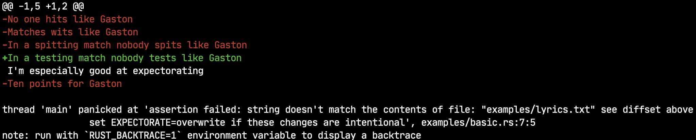

# Expectorate

This is a little library to validate expected output saved in files. It makes it easy to update that content when it should be updated to match the new results.

## Validating Output

Say you have a function `compose()` that produces a string and you have a file named `lyrics.txt` that contain the expected output. You can compare the actual output like this:

```rust
    let actual: &str = compose();
    assert_content!("lyrics.txt", actual);
```

If the output doesn't match, you'll see output like this:



White means that the content matches. Red means that content from the file was missing. Green means that content not in the file was added.

If we want to accept the changes from `compose()` we'd simply run with `EXPECTORATE=overwrite`. Assuming `lyrics.txt` is checked in, `git diff` will show you something like this:

```diff
diff --git a/examples/lyrics.txt b/examples/lyrics.txt
index e4104c1..ea6beaf 100644
--- a/examples/lyrics.txt
+++ b/examples/lyrics.txt
@@ -1,5 +1,2 @@
-No one hits like Gaston
-Matches wits like Gaston
-In a spitting match nobody spits like Gaston
+In a testing match nobody tests like Gaston
 I'm especially good at expectorating
-Ten points for Gaston
```

